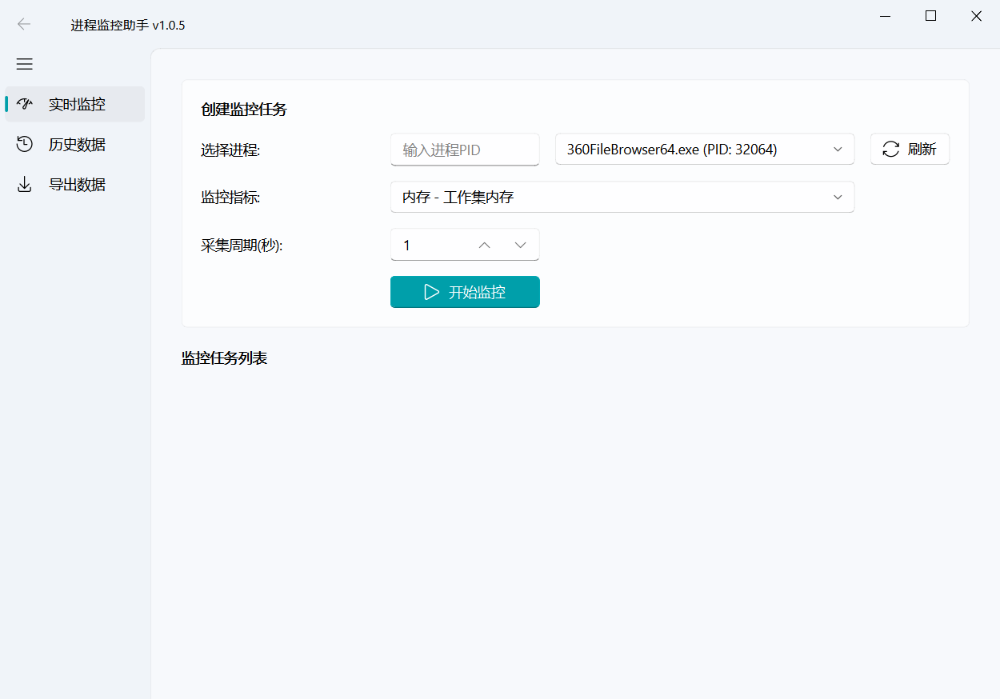
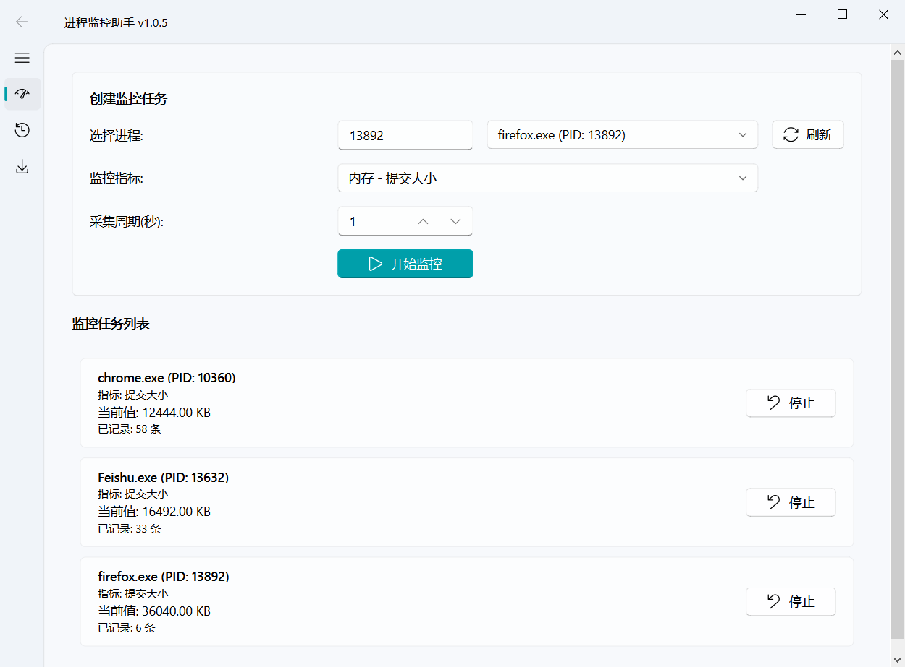
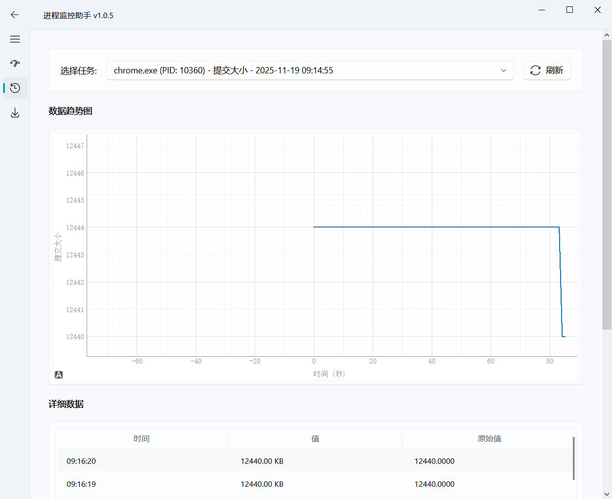
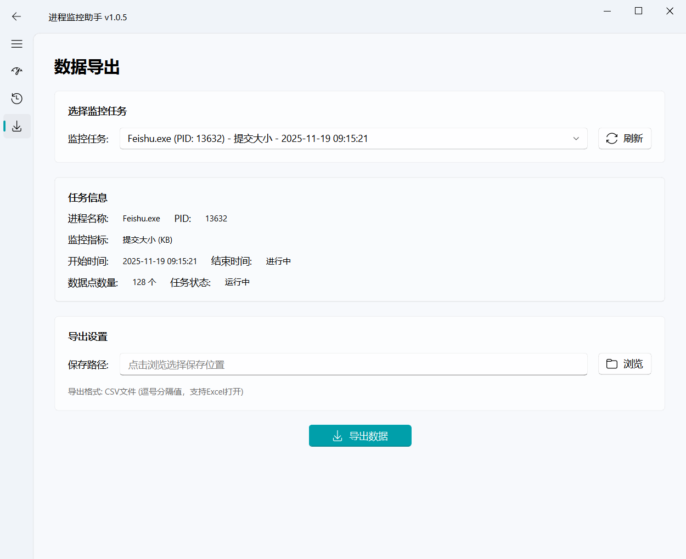

# 进程监控助手

一个基于 PyQt5 和 PyQt-Fluent-Widgets 构建的现代化 Windows 桌面应用程序，用于监控进程的性能指标。

## 界面预览

### 主界面


### 实时监控


### 历史数据


### 数据导出



## 功能特性

- **实时监控**：监控进程的工作集内存、CPU使用率、线程数等多项性能指标
- **多任务支持**：最多同时监控5个进程
- **历史数据**：保存监控数据并以图表和表格形式展示
- **数据导出**：将监控数据导出为CSV文件，支持Excel打开
- **现代化UI**：采用 Windows 11 Fluent Design 风格界面
- **灵活配置**：可自定义采集周期（1-3600秒）

## 系统要求

- Windows 10/11
- Python 3.8+

## 安装依赖

```bash
pip install -r requirements.txt
```

## 运行应用

```bash
python main.py
```

## 使用指南

### 实时监控页面

1. **选择进程**
   - 方式1：直接输入进程PID
   - 方式2：从下拉列表中选择进程（点击"刷新"按钮更新列表）

2. **选择监控指标**（共支持27个指标）
   - **内存相关**（13个）：工作集内存、虚拟内存、内存使用率、工作集峰值、专用工作集、提交大小、提交大小峰值、分页池、分页池峰值、非分页池、非分页池峰值、页面错误、唯一集大小
   - **CPU相关**（4个）：CPU使用率、CPU用户时间、CPU系统时间、优先级
   - **系统资源**（4个）：线程数、句柄数、自愿上下文切换、非自愿上下文切换
   - **IO操作**（6个）：IO读取字节、IO写入字节、IO读取次数、IO写入次数、IO其他字节、IO其他次数

3. **设置采集周期**
   - 输入范围：1-3600秒的整数
   - 默认值：1秒
   - 说明：采用数值输入框，支持任意整数秒数

4. **开始监控**
   - 点击"开始监控"按钮启动监控任务
   - 监控任务卡片会显示在下方列表中
   - 实时更新当前值

5. **停止监控**
   - 点击任务卡片右侧的"停止"按钮

### 历史数据页面

1. **选择任务**
   - 从下拉列表中选择要查看的监控任务
   - 包括正在运行的和已停止的任务

2. **查看数据**
   - 上方图表：显示数据随时间的变化趋势
   - 下方表格：显示详细的数据点记录

### 导出数据页面

1. **选择任务**
   - 从下拉列表中选择要导出的监控任务
   - 点击"刷新"按钮更新任务列表

2. **查看任务信息**
   - 自动显示选中任务的详细信息
   - 包括进程名、PID、监控指标、时间范围、数据点数量等

3. **导出数据**
   - 点击"浏览"按钮选择保存位置和文件名
   - 点击"导出数据"按钮执行导出
   - 导出格式为CSV文件，使用UTF-8编码，支持Excel直接打开
   - 导出成功后自动打开文件所在文件夹

## 项目结构

```
ProcessMonitor/
├── main.py                      # 应用入口
├── config.py                    # 全局配置
├── requirements.txt             # 依赖列表
├── ui/                          # UI层
│   ├── main_window.py           # 主窗口
│   └── pages/                   # 页面
│       ├── monitor_page.py      # 实时监控页面
│       ├── history_page.py      # 历史数据页面
│       └── export_page.py       # 数据导出页面
├── core/                        # 核心业务逻辑层
│   ├── monitor_manager.py       # 监控管理器
│   ├── monitor_task.py          # 监控任务
│   └── process_collector.py     # 进程信息采集器
├── data/                        # 数据层
│   ├── database.py              # 数据库操作
│   └── models.py                # 数据模型
└── utils/                       # 工具层
    └── metrics.py               # 指标定义
```

## 架构设计

本项目采用**分层架构**设计，实现了前后端分离和高内聚低耦合：

- **UI层**：负责用户界面展示和交互
- **核心业务层**：负责监控任务管理和数据采集
- **数据层**：负责数据持久化存储
- **工具层**：提供通用工具和常量定义

层与层之间通过**Qt信号槽机制**进行通信，确保线程安全。

## 打包成可执行文件

本项目提供完整的打包方案，支持一键生成安装包。

### 快速打包（推荐）

**步骤1：一键打包exe**
```bash
cd build
build.bat
```

**步骤2：制作安装包**
1. 下载并安装 [Inno Setup](https://jrsoftware.org/isdl.php)
2. 用Inno Setup打开 `build\setup.iss`
3. 点击菜单：`Build` → `Compile`
4. 安装包位于 `dist\installer\进程监控助手_v1.0.5_Setup.exe`

### 环境要求

- Python 3.8+
- PyInstaller：`pip install pyinstaller`
- Inno Setup 6.x（仅制作安装包时需要）

### 打包产物

- **单文件exe**：`dist\进程监控助手.exe`（约80-100MB）
- **安装包**：`dist\installer\进程监控助手_v1.0.5_Setup.exe`

### 详细说明

完整的打包文档请查看：[build/README_打包说明.md](build/README_打包说明.md)

**打包方案特点**：
- ✅ 一键自动化打包脚本
- ✅ 单文件exe，无需安装即可运行
- ✅ 专业的Windows安装向导
- ✅ 支持自定义安装目录
- ✅ 自动创建快捷方式
- ✅ 卸载时可选保留用户数据

**安装后目录结构**：
```
安装目录\
├── 进程监控助手.exe
└── data\
    └── monitor.db
```

## 技术栈

- **UI框架**：PyQt5 + PyQt-Fluent-Widgets
- **进程监控**：psutil
- **数据可视化**：pyqtgraph
- **数据存储**：SQLite

## 开发说明

- 遵循PEP 8代码规范
- 采用模块化设计，每个模块职责单一
- 使用类型提示提高代码可读性
- 完善的错误处理和用户提示

## 许可证

本项目仅供学习和测试使用。

## 作者

软件测试工程师

## 更新日志

### v1.0.5 (2025-11-17)
- 新增数据导出功能
- 支持将监控数据导出为CSV文件
- CSV文件使用UTF-8 BOM编码，确保Excel正确打开中文
- 导出数据包含时间、指标值、原始值、进程信息等完整信息
- 导出成功后自动打开文件所在文件夹
- 优化界面UI效果：标题栏显示版本号、透明背景、移除黑色边框
- 升级历史数据表格为Fluent-Widgets TableWidget组件
- 清理无效配置项（移除未使用的配置）

### v1.0.4 (2025-11-17)
- 内存单位统一改为KB
- 新增18个监控指标
- 支持更全面的进程性能监控

### v1.0.3 (2025-11-16)
- 修复历史数据页面显示和交互问题
- 优化页面刷新逻辑

### v1.0.2 (2025-11-16)
- 优化UI界面
- 修复已知Bug

### v1.0.1 (2025-11-15)
- 修复Bug
- 优化UI体验

### v1.0.0 (2025-11-15)
- 首次发布
- 实现基本的进程监控功能
- 支持多种性能指标
- 历史数据查看功能
- Fluent UI 风格界面
