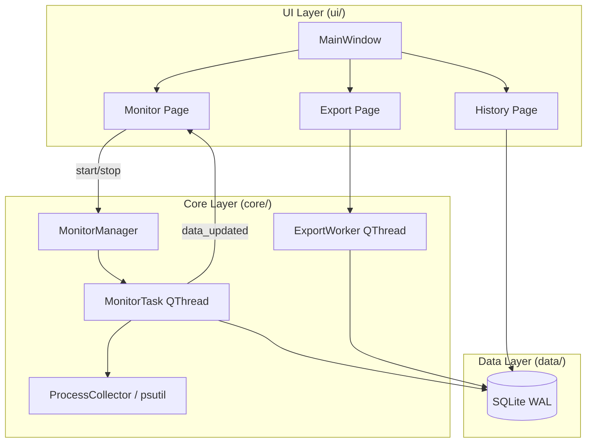

<div align="center">

# ProcessMonitor

A lightweight Windows desktop tool for real-time per-process resource monitoring, history visualization and CSV export.

[](https://github.com/liujialu0330/ProcessMonitor/actions/workflows/ci.yml)
[](https://github.com/liujialu0330/ProcessMonitor/releases)
[](https://github.com/liujialu0330/ProcessMonitor/releases)
[](https://github.com/liujialu0330/ProcessMonitor)
[](https://github.com/liujialu0330/ProcessMonitor)
[](./LICENSE)

English | [简体中文](./README.zh-CN.md)


</div>

ProcessMonitor is a Windows 11 Fluent Design desktop app for keeping an eye on any running process. Pick a process by PID or from a live list, choose from 27 metrics across memory, CPU, system and I/O categories, and watch the numbers update on a configurable sampling interval — from every second up to once an hour. Every sample is persisted locally, so you can replay it as a chart, browse it as a table, or export it to CSV for further analysis.

## ✨ Features

### 🔍 Monitoring
- **27 metrics, 4 categories** — memory (working set, private bytes, page faults, USS, ...), CPU (usage, user/kernel time, priority), system (threads, handles, context switches) and I/O (read/write bytes and counts)
- **Multi-metric tasks** — check any combination of metrics for a single task; they're all sampled on the same clock and timestamp
- **Up to 5 concurrent tasks** — monitor several processes side by side
- **Configurable interval** — any integer from 1 to 3600 seconds, default 1s

### 📊 Data & Export
- **Downsampled history charts** — large tasks are bucketed on the database side (up to 2,000 buckets, min/max per bucket) so peaks and valleys stay visible without shipping every raw point
- **Fast history table** — shows the most recent 2,000 samples for smooth scrolling even on long-running tasks (exports are never truncated — always the full dataset)
- **Wide-format CSV export** — one row per sample, one column per metric, background-thread export with mid-export cancel support
- **One-click cleanup** — delete a finished task's data straight from the History page

### 🛡 Reliability
- **Auto-update** — checks GitHub Releases on startup (or on demand), downloads and launches the installer for you
- **Crash-resilient storage** — SQLite with WAL mode, automatic retry on failed writes, crash/error logging, and automatic recovery of orphaned "running" tasks after an unclean shutdown
- **Automated test suite** — 66 test cases covering the data layer, schema migration, export and update-check logic
- **Measured performance** — opening a 770k-row history task takes ~1.4s (down from 3.4s pre-v1.2.0; measured on the maintainer's dev machine)

## 📸 Screenshots

| Real-time Monitoring | History Data |
|---|---|
|  |  |

| Data Export | |
|---|---|
|  | |

## 🚀 Getting Started

### For Users

1. Grab the latest installer from [Releases](https://github.com/liujialu0330/ProcessMonitor/releases) — `Windows_v*_Setup.exe`
2. Run it and follow the setup wizard (custom install directory supported)
3. Launch **ProcessMonitor** from the Start Menu

Installing a new version over an existing install keeps your history data.

### For Developers

```bash
git clone https://github.com/liujialu0330/ProcessMonitor.git
cd ProcessMonitor
pip install -r requirements.txt
python main.py
```

### Notes

- **System requirements**: Windows 10/11 (64-bit); Python 3.8+ to run from source (CI and release builds use 3.11)
- **Data storage**: `%LOCALAPPDATA%\进程监控助手\data\monitor.db` (SQLite, WAL mode); logs live under `%LOCALAPPDATA%\进程监控助手\logs\`
- **Auto-update**: checks GitHub Releases on startup and from the About page; you can download and run the installer without leaving the app

## 🏗 Architecture

ProcessMonitor is built with PyQt5 + PyQt-Fluent-Widgets for the UI, psutil for process metrics, pyqtgraph for charts, and SQLite for storage. It follows a layered design — UI, core business logic and data — connected through Qt signals/slots to keep cross-thread communication safe.


```mermaid
flowchart TD
    subgraph UI["UI Layer (ui/)"]
        MW[MainWindow] --> MP[Monitor Page]
        MW --> HP[History Page]
        MW --> EP[Export Page]
    end
    subgraph Core["Core Layer (core/)"]
        MM[MonitorManager] --> MT[MonitorTask QThread]
        MT --> PC[ProcessCollector / psutil]
        EW[ExportWorker QThread]
    end
    subgraph Data["Data Layer (data/)"]
        DB[(SQLite WAL)]
    end
    MP -->|start/stop| MM
    MT -->|data_updated| MP
    MT --> DB
    HP --> DB
    EP --> EW --> DB
```

## 🛠 Development

```bash
python -m pytest tests/
```

- CI runs the test suite on every push and pull request (see the CI badge above)
- To build a Windows installer, see [build/README_打包说明.md](build/README_打包说明.md)

## 🗺 Roadmap

- [ ] Export history data to Excel format
- [ ] Multi-process comparison view
- [ ] Fuzzy search by process name

See [CHANGELOG.md](./CHANGELOG.md) or [GitHub Releases](https://github.com/liujialu0330/ProcessMonitor/releases) for the full release history.

## 🤝 Contributing

Issues and pull requests are welcome. Please make sure `python -m pytest tests/` passes and CI is green before submitting a PR.

## 📄 License

Released under the [MIT License](./LICENSE).

Maintained by [liujialu](https://github.com/liujialu0330).
