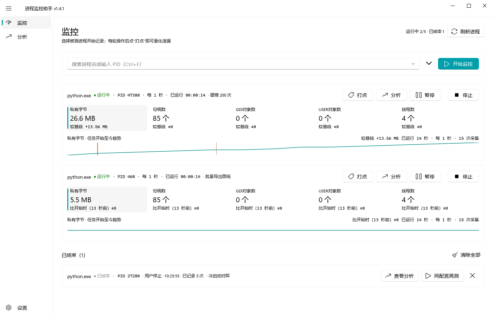
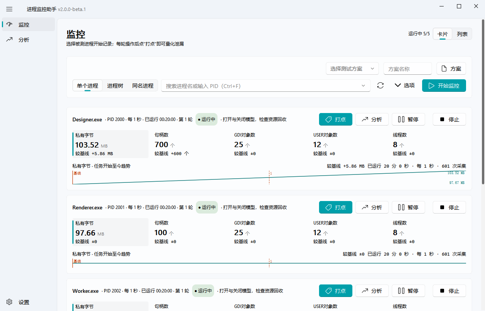
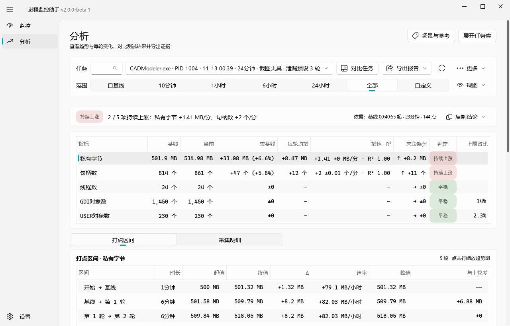
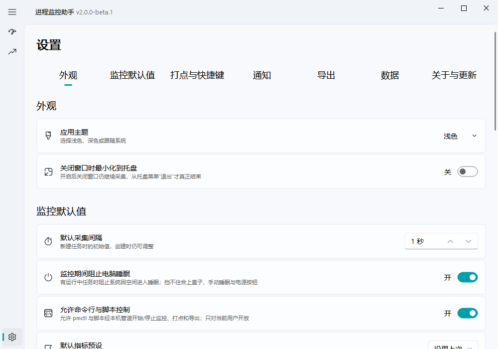
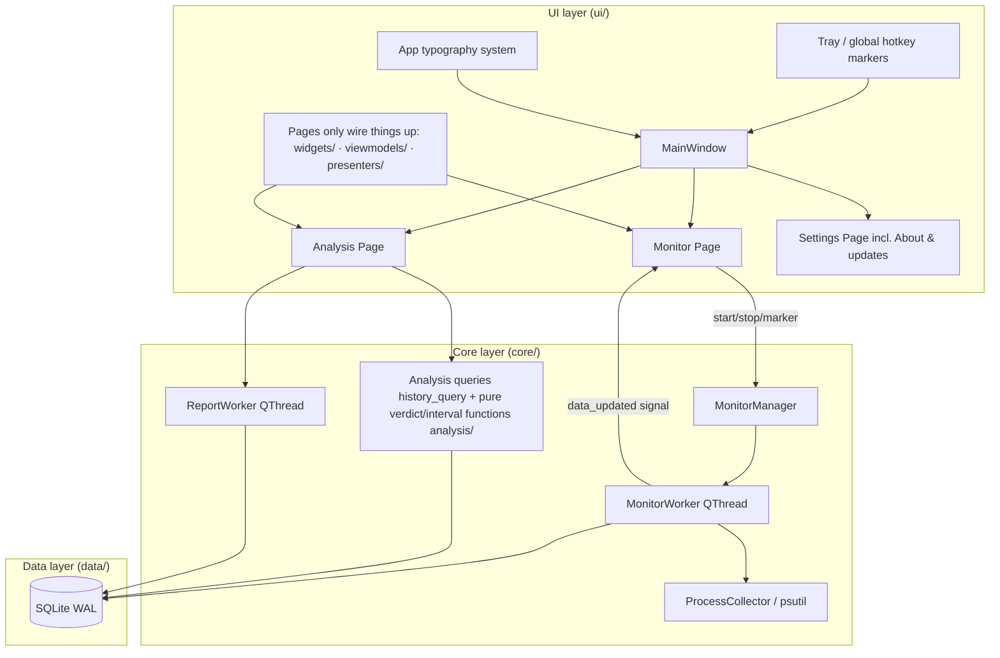

<div align="center">

# ProcessMonitor

A lightweight Windows desktop tool for real-time process resource monitoring, baseline-and-marker leak verdicts and one-click analysis reports.

[](https://github.com/liujialu0330/ProcessMonitor/actions/workflows/ci.yml)
[](https://github.com/liujialu0330/ProcessMonitor/releases)
[](https://github.com/liujialu0330/ProcessMonitor/releases)
[](https://github.com/liujialu0330/ProcessMonitor)
[](https://github.com/liujialu0330/ProcessMonitor)
[](./LICENSE)

English | [简体中文](./README.zh-CN.md)



</div>

## Version 2.0.1

Version 2.0.1 fixes an exception when clicking section navigation in Settings. All seven sections are covered by real mouse-click regression tests and desktop interaction checks; see the [fix verification](doc/2.0.1修复验收.md).

Version `2.0.0` adds process trees and same-name process groups, automatic markers and stop conditions, crash evidence and restart recovery, evidence bundles, reusable multi-target plans, comparison of up to four tasks, and scenario references. Monitoring offers card and list views; the task library supports search, stars, and batch deletion.

The first launch upgrades older databases to schema v5 and keeps a `.bak_v1` backup. Large databases may take time to migrate; the default data directory stays the same. Keep enough free disk space and read the [upgrade and rollback notes](CHANGELOG.md).

Download the [2.0.1 installer](https://github.com/liujialu0330/ProcessMonitor/releases/tag/v2.0.1), or check for updates from version 1.4.1 or 2.0.0. In 2.0.0, scroll to the bottom of Settings to reach the update button. The implementation, functional regression, remote CI, performance, installation/uninstallation, and both rollback paths have been validated. The remaining 24-hour soak, device-specific checks, and multi-user trial were not run and are not counted as passes. See the [acceptance record](doc/2.0.0验收记录.md) for the original 2.0 scope and the [fix verification](doc/2.0.1修复验收.md) for the navigation regression.

```bat
python main.py
python pmctl.py start --plan D:\plans\window-cycle.json
python pmctl.py verdict --task TASK_ID --vs-reference
```

Save, import, or export plans from the monitoring page. Notes allow up to 2,000 characters; wait timeouts accept fractional seconds, with an empty field meaning no timeout. Redirected `pmctl` output uses UTF-8; `--json` uses standard Unicode escapes for Chinese text and emoji. See the [automation guide](tools/README.md) for commands and JSON examples.


ProcessMonitor is a Windows 11 Fluent Design desktop app for keeping an eye on any running process. Pick a process by PID or from a live list, choose from 26 metrics across memory, CPU, system and I/O categories, and watch the numbers update on a configurable sampling interval — from every second up to once an hour. Every sample is persisted locally; the Analysis page gives each metric a verdict, round-by-round increases and trend charts, lets you compare up to four test runs, and exports a report image plus CSV files in one click.

## ✨ Features

### 🧭 Recommended workflow: hunting leaks

1. On the Monitor page, pick the target process. The default "Leak check" preset (private bytes, handles, GDI objects, USER objects, threads) is pre-selected and your last choice is remembered; add a test note if you like, then start. If the target is not running yet, tick "Start automatically when the process launches".
2. Let the target warm up to a steady state and drop the first marker — its default name is "Baseline".
3. After each round of the operation under test (e.g. open and close a window N times), drop another marker; they are numbered "Round 1", "Round 2", ... automatically. With your hands on the app under test, press the global hotkey Ctrl+Alt+M or use the tray menu's "Marker" instead of switching windows.
4. On the Analysis page, read the verdict summary: for every metric, the change since baseline, the mean increase per round, the growth rate (with confidence interval and R²) and a verdict (Rising / Stable / Fluctuating / Not enough data). The interval table lists the increase round by round — growth after every round that never falls back is the classic leak signature.
5. Click "Export report" to get a report image, a detail CSV and a summary CSV, ready to attach to a bug report.

### 🔍 Monitoring
- **26 metrics, 4 categories** — memory (working set, private bytes, page faults, USS, ...), CPU (usage, user/kernel time, base priority), system (threads, handles, GDI/USER objects, voluntary context switches) and I/O (read/write bytes and counts); names follow Task Manager and every metric has a one-line description, shown as a tooltip in the metric picker
- **Private bytes as the leak indicator** — the former "virtual memory", "commit size" and "private working set" metrics were identical on Windows and are merged into "private bytes", the primary metric for spotting memory leaks
- **Honest gaps instead of fake zeros** — when a metric cannot be read, the task card shows "unavailable" with the reason and nothing is recorded for it. Availability depends on process permissions, session, and system interfaces, even when running as administrator; GDI/USER objects of processes in other sessions (e.g. system services) show "not supported"
- **Cards you can read at a glance** — a status pill (Running / Paused / Ended / Ended abnormally) and elapsed time; each metric shows its change since baseline (median of the 5 samples after the baseline marker) or since start; the sparkline covers "task start until now" with marker ticks
- **Markers without breaking your flow** — the card's "Marker" button, the tray menu and a global hotkey (Ctrl+Alt+M by default, configurable in Settings), all numbered "Baseline / Round N" automatically; pausing and resuming add system markers
- **Wait for the process to launch** — start waiting before the target runs; monitoring begins with your chosen settings the moment it appears, so you can watch start-up too
- **Careful task creation** — no process is pre-selected, creating a second task for the same PID asks for confirmation, one search box accepts either a process name or a PID (F5 refreshes the list, Ctrl+F focuses the search box, and the list refreshes when you come back to the window); once tasks exist the new-task form collapses to a single row
- **Multi-metric, multi-task** — any metric combination per task, sharing one interval and timestamp; up to 5 running tasks at once (the quota counts running tasks only); any integer interval from 1 to 3600 seconds, default 1s
- **Pause & resume** — pause a task without losing history; resuming samples immediately
- **Finished tasks stay around** — an ended task collapses into a single row in the "Ended" group with "View analysis", "Run again with same settings", "Close" and a "Clear all" button; if the target process ends unexpectedly you get an in-app notice, plus a tray balloon when the window is in the background
- **Steady sampling** — scheduled on a monotonic-clock deadline so it does not drift over time, does not backfill after the machine sleeps, and detects PID reuse so a new process is never mistaken for the original

### 📊 Analysis & Reports
- **Verdict summary** — one row per metric: baseline, current, change since baseline, mean increase per round, growth rate ± confidence interval · R², recent trend, verdict and GDI/USER quota usage, with the basis spelled out (e.g. "since baseline 16:37:33 · 2h15m · 8,100 points"); with too few samples (under 30 points or too short a span) it says "Not enough data" instead of extrapolating scary numbers
- **Sensible statistics** — with a baseline, only data after it is counted; cumulative metrics (CPU time, I/O bytes and counts, ...) are plotted as per-second rates with an average rate instead of an extrapolated growth rate; peak metrics show how many times they rose; sampling gaps break the curve and are shaded
- **Trend charts** — small multiples (one chart per metric) or a single Δ% overlay, linked crosshairs, min/max bands that keep peaks and valleys; absolute or relative time axis; drag a range on the overview strip to re-run the statistics on it; right-click a chart to add a marker, set the baseline, rename or delete markers
- **Marker intervals** — the focused metric split at the baseline and every round: duration, start/end values, increase, rate, peak and "vs. previous round"; click a row to zoom into it; a detail table (with "vs. previous" and "vs. baseline") is one tab away
- **Task comparison** — pick a second task (e.g. before and after a fix) to overlay the same metric's change from each task's own starting point on a relative time axis, with both round-by-round tables side by side
- **One-click report** — a report image (verdicts + small-multiple charts), a detail CSV (metadata lines, elapsed seconds, blank rows at gaps, a final marker column) and a metric × interval summary CSV; or export only the CSV, only the image, or copy the image; files are written to a temp file first and only replace the target on success, in the background, and the folder opens only when you click
- **Auto-refresh for running tasks** — the Analysis page follows the live data with a refresh interval that adapts to the data volume; all loading runs in the background, so large tasks never freeze the UI
- **Controlled cleanup** — delete a finished task from the Analysis page's More menu, with confirmation; database cleanup and compaction are unavailable while any task is running or an export is in progress

### ⚙️ Settings & Personalization
- **Theme** — light, dark, or follow the system, switches instantly
- **Consistent typography** — Segoe UI / Microsoft YaHei UI type stack, 24px page titles and monospaced data labels
- **Defaults & retention** — default sampling interval and a history retention policy (forever / 7 / 30 / 90 / 180 days)
- **Marker hotkey** — press the new key combination right in Settings, or clear it to turn the hotkey off; if another app owns the combination, Settings says so
- **Database maintenance** — see disk usage and compact (or clean up + compact, per the retention policy) in one click
- **System tray and close behavior** — optionally minimize to tray on close and keep monitoring; closing the window while tasks are running asks "Stop and exit / Minimize to tray / Cancel" (skipped on logoff or shutdown)
- **About & updates** — version info and update checks now live in Settings
- **Single instance** — launching the app again activates the open window instead of starting a second copy

### 🛡 Reliability & Security
- **Auto-update** — checks GitHub Releases on startup (or on demand) with a non-modal notice; downloads are restricted to official GitHub hosts and the installer's SHA-256 is verified, and if no checksum is published you are pointed to the release page for a manual download
- **Crash-resilient storage** — SQLite with WAL mode, automatic retry on failed writes, crash/error logging (5MB x 5 rotation), and automatic recovery of orphaned "running" tasks after an unclean shutdown
- **Safe database upgrades** — upgrades run in an explicit transaction and roll back on failure, restoring from the automatic backup so old data is never lost
- **Never freezes on stop** — stopping a task or exiting the app does not block the UI, and all collected data is flushed to disk before exit
- **Automated test suite** — 4,700+ test cases covering the data layer, migration, collection and scheduling, verdicts and interval statistics, report export, the global hotkey (with a fake backend), update verification, page flows and UI contracts, plus an offscreen smoke test of the whole "start → baseline → two rounds → analysis → export report → close" path; tests use a temporary data directory and never touch real data
- **Measured performance** — opening a 770k-row history task takes ~1.4s (down from 3.4s pre-v1.2.0; measured on the maintainer's dev machine)

## 📸 Screenshots

| Monitor | Analysis |
|---|---|
|  |  |

| Settings (incl. About & updates) |
|---|
|  |

## 🚀 Getting Started

### For Users

1. Grab the latest installer from [Releases](https://github.com/liujialu0330/ProcessMonitor/releases) — `Windows_v*_Setup.exe`
2. Run it and follow the setup wizard (custom install directory supported)
3. Launch **ProcessMonitor** from the Start Menu

Installing a new version over an existing install keeps your history data.

### For Developers

```bash
git clone https://github.com/liujialu0330/ProcessMonitor.git
cd ProcessMonitor
pip install -r requirements.txt
python main.py
```

### Notes

- **System requirements**: Windows 10/11 (64-bit); use Python 3.11 for source runs and locked dependencies (CI verified on 3.11.9)
- **Data storage**: `%LOCALAPPDATA%\进程监控助手\data\monitor.db` (SQLite, WAL mode); logs live under `%LOCALAPPDATA%\进程监控助手\logs\`
- **Auto-update**: checks GitHub Releases on startup and from Settings → About & updates; you can download and run the installer without leaving the app

## 🏗 Architecture

ProcessMonitor is built with PyQt5 + PyQt-Fluent-Widgets for the UI, psutil for process metrics, pyqtgraph for charts, and SQLite for storage. It follows a layered design — UI, core business logic and data — connected through Qt signals/slots to keep cross-thread communication safe. See [doc/代码架构说明.md](doc/代码架构说明.md) (Chinese) for the detailed structure.


```mermaid
flowchart TD
    subgraph UI["UI layer (ui/)"]
        MW[MainWindow] --> MP[Monitor Page]
        MW --> AN[Analysis Page]
        MW --> SP[Settings Page incl. About & updates]
        TR[Tray / global hotkey markers] --> MW
        TS[App typography system] --> MW
        UW[Pages only wire things up: widgets/ · viewmodels/ · presenters/] --> MP
        UW --> AN
    end
    subgraph Core["Core layer (core/)"]
        MM[MonitorManager] --> MT[MonitorWorker QThread]
        MT --> PC[ProcessCollector / psutil]
        HQ[Analysis queries history_query + pure verdict/interval functions analysis/]
        RW[ReportWorker QThread]
    end
    subgraph Data["Data layer (data/)"]
        DB[(SQLite WAL)]
    end
    MP -->|start/stop/marker| MM
    MT -->|data_updated signal| MP
    MT --> DB
    AN --> HQ --> DB
    AN --> RW --> DB
```

## 🛠 Development

```bash
python -m pytest tests/
```

- List the test cases with `pytest --collect-only -q`; tests use a temporary data directory by default, and the runtime data directory can be overridden with the `PROCESS_MONITOR_DATA_DIR` environment variable (logs then go to its `logs\` subfolder)
- Functional CI runs on pushes to `main` or `codex/release-validation-*`, pull requests targeting `main`, and manual dispatch (see the CI badge above)
- To build a Windows installer, see [build/README_打包说明.md](build/README_打包说明.md)

## 🗺 Roadmap

- [ ] Export data to Excel format
- [x] Compare up to four tasks (v2.0.0)
- Threshold alerts are outside the current scope.

See [CHANGELOG.md](./CHANGELOG.md) or [GitHub Releases](https://github.com/liujialu0330/ProcessMonitor/releases) for the full release history.

## 🤝 Contributing

Issues and pull requests are welcome. Please make sure `python -m pytest tests/` passes and CI is green before submitting a PR.

## 📄 License

Released under the [MIT License](./LICENSE).

Maintained by [liujialu](https://github.com/liujialu0330).
