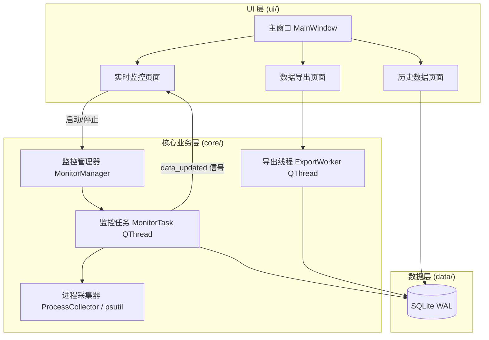

<div align="center">

# 进程监控助手 ProcessMonitor

一款轻量的 Windows 桌面工具，用于实时监控单个进程的资源占用、查看历史趋势并导出 CSV 数据。

[](https://github.com/liujialu0330/ProcessMonitor/actions/workflows/ci.yml)
[](https://github.com/liujialu0330/ProcessMonitor/releases)
[](https://github.com/liujialu0330/ProcessMonitor/releases)
[](https://github.com/liujialu0330/ProcessMonitor)
[](https://github.com/liujialu0330/ProcessMonitor)
[](./LICENSE)

[English](./README.md) | 简体中文


</div>

进程监控助手是一款 Windows 11 Fluent Design 风格的桌面应用，用于持续观察某个进程的运行状态。通过 PID 或从进程列表中选择目标进程后，可从内存、CPU、系统资源、I/O 四大类共 27 个指标中任意勾选，并以 1 秒到 1 小时之间任意整数秒的周期采集数据。所有采集结果会自动落库，既可以图表形式回放趋势，也可以表格形式逐条查看，还能一键导出为 CSV 做进一步分析。

## ✨ 功能特性

### 🔍 实时监控
- **27 个指标，4 大分类**：内存（工作集内存、专用工作集、页面错误、唯一集大小等）、CPU（使用率、用户/内核时间、优先级）、系统资源（线程数、句柄数、上下文切换）、I/O（读写字节数与次数）
- **多指标同采**：单个监控任务可同时勾选任意组合的指标，共用同一采集周期与同一时间戳
- **多任务并行**：最多同时监控 5 个进程
- **灵活采集周期**：1~3600 秒之间任意整数，默认 1 秒

### 📊 数据与导出
- **历史图表降采样**：数据量较大的任务会在数据库端按分桶处理（最多 2000 桶，每桶取最小/最大值），在不传输全部原始点的情况下保留波峰波谷
- **历史表格提速**：只加载最近 2000 次采集，长时间任务也能流畅滚动查看（导出数据不受此限制，始终为全量）
- **CSV 宽表导出**：每行对应一次采集、每个指标独立成列，后台线程执行，支持导出中途取消
- **一键清理**：在历史数据页面即可删除不再需要的任务数据

### 🛡 稳定性
- **自动更新**：启动时（或手动）检测 GitHub Release 新版本，可直接下载并启动安装向导
- **抗崩溃存储**：SQLite 启用 WAL 模式、数据落库失败自动重试、崩溃与异常自动记录日志，程序意外退出后再次启动会自动修正遗留的"运行中"任务状态
- **自动化测试基座**：66 个用例覆盖数据层、数据库迁移、导出、更新检查等核心逻辑
- **实测性能**：77 万行规模的历史任务，打开耗时约 1.4 秒（v1.2.0 优化前为 3.4 秒；数据来自维护者本机实测）

## 📸 界面截图

| 实时监控 | 历史数据 |
|---|---|
|  |  |

| 数据导出 | |
|---|---|
|  | |

## 🚀 快速开始

### 普通用户

1. 前往 [Releases](https://github.com/liujialu0330/ProcessMonitor/releases) 下载最新安装包 `Windows_v*_Setup.exe`
2. 运行安装包，按向导完成安装（支持自定义安装目录）
3. 从开始菜单启动**进程监控助手**

覆盖安装新版本会保留原有的历史数据。

### 开发者

```bash
git clone https://github.com/liujialu0330/ProcessMonitor.git
cd ProcessMonitor
pip install -r requirements.txt
python main.py
```

### 补充说明

- **系统要求**：Windows 10/11（64位）；源码运行需 Python 3.8+（CI 与发布构建统一使用 3.11）
- **数据存储位置**：`%LOCALAPPDATA%\进程监控助手\data\monitor.db`（SQLite，已启用 WAL 模式）；日志位于 `%LOCALAPPDATA%\进程监控助手\logs\`
- **自动更新**：启动时或在"关于"页面手动检查 GitHub Release 新版本，可在应用内直接下载并启动安装程序

## 🏗 架构设计

项目采用 PyQt5 + PyQt-Fluent-Widgets 构建界面，psutil 采集进程指标，pyqtgraph 负责图表渲染，SQLite 负责数据持久化。整体分为 UI 层、核心业务层、数据层三层，层与层之间通过 Qt 信号槽机制通信，保证跨线程调用安全。



## 🛠 开发指南

```bash
python -m pytest tests/
```

- 每次 push 和 PR 都会触发 CI 自动跑测试（见上方 CI 徽章）
- 打包为 Windows 安装包的完整说明见 [build/README_打包说明.md](build/README_打包说明.md)

## 🗺 后续规划

- [ ] 导出历史数据为 Excel 格式
- [ ] 多进程对比视图
- [ ] 进程名称模糊搜索

完整版本历史见 [CHANGELOG.md](./CHANGELOG.md) 或 [GitHub Releases](https://github.com/liujialu0330/ProcessMonitor/releases)。

## 🤝 贡献指南

欢迎提交 Issue 与 Pull Request。提交 PR 前请确保本地 `python -m pytest tests/` 通过，并保证 CI 为绿色状态。

## 📄 许可证

本项目基于 [MIT License](./LICENSE) 开源。

维护者：[liujialu](https://github.com/liujialu0330)。
